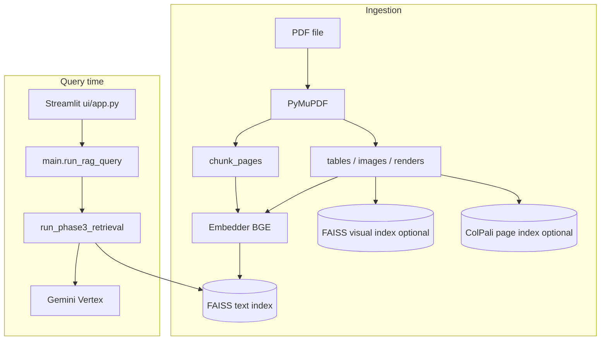

# Full project architecture — components and what they’re for

This document maps **tasks** to **technologies and modules** in this repository (similar to: *RecursiveCharacterTextSplitter for chunking*). Paths are relative to the repo root unless noted.

---

## 1. High-level system

**Single orchestrator:** `main.py` — `index_pdf` (build indexes) and `run_rag_query` (retrieve + answer). **Config:** `configs/settings.py` + `.env` / `.env.example`.

---

## 2. Ingestion — PDF → structured chunks → ready to embed

| Task | What you use | Where |
|------|----------------|--------|
| Read PDF pages as text | **PyMuPDF** (`fitz`) | `ingestion/pdf_loader.py` — `extract_pages` |
| Split page text into chunks | **LangChain** `RecursiveCharacterTextSplitter` | `ingestion/chunker.py` — `chunk_pages` |
| Optional: extract tables | **pdfplumber** (default) or **Camelot** (optional) | `ingestion/tables_extract.py`, `ingestion/tables_normalize.py` |
| Optional: extract embedded images | **PyMuPDF** | `ingestion/images_extract.py` |
| Optional: caption figures for retrieval | **Vertex Gemini** multimodal | `generation/image_caption.py` |
| Optional: full-page / figure pixmaps | **PyMuPDF** rendering | `ingestion/page_render_extract.py` |
| Optional: ColPali page PNGs | Rasterize pages to disk | `ingestion/colpali_raster.py` |

---

## 3. Embeddings and vector indexes

| Task | What you use | Where |
|------|----------------|--------|
| Text embeddings (chunks + queries) | **sentence-transformers** `SentenceTransformer` (default **BAAI/bge-small-en-v1.5**) | `retrieval/embedder.py` — `Embedder` |
| Text vector store + search | **faiss-cpu** `IndexFlatIP` + JSON metadata | `retrieval/vector_store.py` — `FaissVectorStore` |
| Optional: CLIP-style image + query vectors | **torch** + CLIP/OpenCLIP stack (lazy-loaded) | `retrieval/visual_embedder.py` |
| Optional: visual FAISS index | **faiss-cpu** separate index aligned to `chunk_id` | Built in `main.index_pdf` / `retrieval/visual_index.py` |
| Optional: ColPali page embeddings | **transformers** + ColPali-class model | `retrieval/colpali_retrieval.py` — `build_colpali_page_index` |
| Pick torch device (MPS/CUDA/CPU) | Helper | `retrieval/torch_device.py` |

---

## 4. Retrieval — query → ranked context chunks

| Task | What you use | Where |
|------|----------------|--------|
| Orchestrate dense → sparse → rerank → visual fusion | Python pipeline | `retrieval/pipeline.py` — **`run_phase3_retrieval`** |
| Dense top-K from FAISS | Inner product search on normalized vectors | `retrieval/vector_store.py` + `pipeline.py` |
| Sparse lexical search | **rank_bm25** `BM25Okapi` (fallback scorer if import fails) over JSON corpus | `retrieval/bm25.py` — `SimpleBM25Retriever`; corpus from `SPARSE_INDEX_PATH` (built via `scripts/index_phase3_sparse.py`) |
| Fuse dense + sparse scores | Weighted fusion | `retrieval/hybrid_retriever.py` — `fuse_dense_sparse` |
| Re-order fused list with cross-encoder | **sentence-transformers** `CrossEncoder` | `reranking/cross_encoder.py` — `rerank_candidates`; invoked from `pipeline.py` |
| Optional: intent (text / table / image / mixed) | Heuristics ± **Gemini** JSON classifier | `retrieval/modality_router.py`; bias in `retrieval/modality_rank.py` |
| Optional: merge CLIP visual hits with text hits | Score fusion | `retrieval/visual_fusion.py`, gates in `retrieval/visual_index.py` |
| Optional: pre-query LLM rewrite | **Vertex Gemini** | `generation/query_refinement.py` — `refine_search_query` |
| Optional: merge raw + refined retrieval lists | Custom merge by `chunk_id` | `retrieval/dual_query_merge.py` — `merge_dual_retrieval_contexts` |
| Optional: ColPali MaxSim page search | Late interaction over page tokens | `retrieval/colpali_retrieval.py` — `search_colpali_pages` |
| Optional: second hop (sub-query) | **Gemini** JSON sub-query + second `run_phase3_retrieval` | `retrieval/multihop.py`, `generation/multihop_prompts.py` |
| Merge hop-1 and hop-2 contexts | Dedupe by `chunk_id` | `retrieval/multihop.py` — `merge_contexts` |
| Dense-only fallback (errors) | Same FAISS + `retrieve_context` | `main.py` — `_retrieve_context` |

---

## 5. Generation — prompt + Gemini answer

| Task | What you use | Where |
|------|----------------|--------|
| Build grounded text prompt (citations, table/figure tags) | String templates | `generation/prompt_builder.py` — `build_grounded_prompt` |
| Call Vertex generative model | **google-cloud-aiplatform** `GenerativeModel` | `generation/llm_pipeline.py` — `GeminiClient` (`answer`, `answer_with_image`, `answer_with_images`) |
| Final answer assembly | Combines prompt + optional user image / ColPali page images | `main.py` — `answer_query` |

---

## 6. Caching, fingerprinting, observability

| Task | What you use | Where |
|------|----------------|--------|
| Semantic cache (query embedding → cached answer) | **faiss-cpu** + JSON sidecar | `cache/semantic_cache.py` |
| Invalidate cache when index/model changes | File stats + paths hash | `cache/index_fingerprint.py` — `compute_index_fingerprint` |
| Optional traces | **Langfuse** client (if env keys set) | `main.py` — `_trace_event` |
| Load env vars | **python-dotenv** | `main.py`, `ui/app.py` (top-level `load_dotenv`) |

---

## 7. UI and evaluation

| Task | What you use | Where |
|------|----------------|--------|
| Web UI (upload PDF, ask questions, show context) | **Streamlit** | `ui/app.py`; chunk evidence widgets `ui/context_evidence.py` |
| Offline metrics / judge | **RAGAS**, **pandas**, **Vertex Gemini** | `evaluation/*.py`; runners `scripts/run_phase2_eval.py`, `scripts/prepare_phase2_dataset.py` |

---

## 8. Scripts (operations)

| Script | Purpose |
|--------|---------|
| `scripts/index_phase3_sparse.py` | Build BM25 JSON corpus from indexed metadata |
| `scripts/rebuild_visual_faiss.py` | Rebuild CLIP visual FAISS from existing meta + assets |
| `scripts/rebuild_colpali.py` | Build / refresh ColPali page index |
| `scripts/index_phase2_corpus.py`, `scripts/prepare_phase2_dataset.py`, `scripts/run_phase2_eval.py` | Evaluation corpus and reports |

---

## 9. Configuration surface

| Layer | Source |
|-------|--------|
| Defaults + env mapping | `configs/settings.py` (`Settings` dataclass) |
| Hot-reload safety (missing attrs) | `ensure_phase4_fields`, `ensure_phase5_fields`, `ensure_phase6_fields`, `ensure_colpali_fields` |
| Human-readable list of variables | `.env.example` |

---

## 10. Dependency stack (summary)

| Technology | Typical use in this project |
|------------|----------------------------|
| **Python 3.10+** | Runtime |
| **PyMuPDF** | PDF text, images, page renders |
| **pdfplumber** / optional **camelot-py** | Tables |
| **langchain-text-splitters** | `RecursiveCharacterTextSplitter` in chunker |
| **sentence-transformers** | BGE embeddings + cross-encoder reranker |
| **faiss-cpu** | Text index, optional visual index, semantic cache index |
| **rank_bm25** (`BM25Okapi`) | Sparse retrieval |
| **torch** / **transformers** | CLIP visual embedder, ColPali |
| **google-cloud-aiplatform** | Vertex Gemini (QA, captions, router, refinement, sub-query) |
| **Streamlit** | UI |
| **pytest** | Tests |
| **pandas**, **ragas** | Evaluation |
| **langfuse** | Optional tracing |
| **Pillow** | Image resize / UI |

---

## 11. Related docs

- [ONBOARDING.md](ONBOARDING.md) — how to read the repo  
- [DEBUGGING.md](DEBUGGING.md) — how to isolate failures  
- [superpowers/README.md](superpowers/README.md) — phase-by-phase design and implementation plans  

This file is descriptive; for exact flags and edge cases, prefer **`configs/settings.py`** and **`docs/superpowers/specs/*.md`**.
