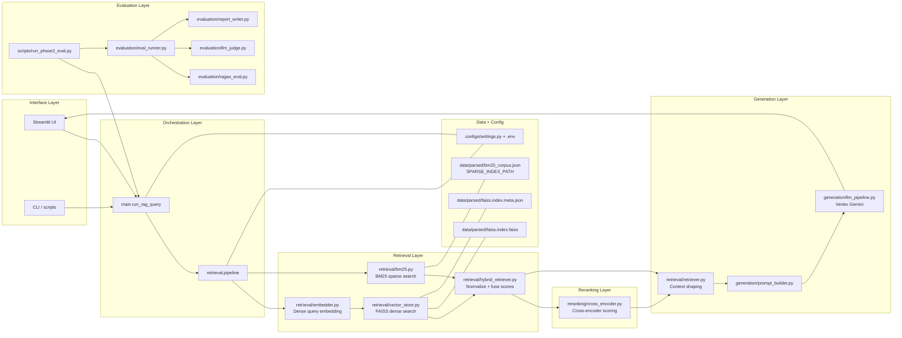
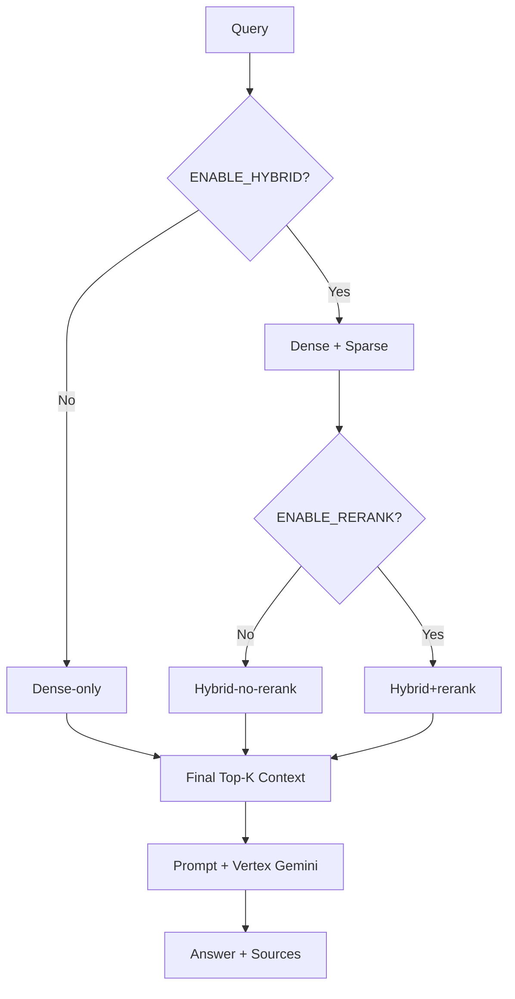

# Phase 3 Hybrid Retrieval + Reranking Design

## Goal

Improve retrieval quality by combining dense vector retrieval with sparse keyword retrieval, then reranking fused candidates with a cross-encoder before generation.

## Scope

This design covers:

- Sparse retrieval (BM25)
- Hybrid score fusion (dense + sparse)
- Cross-encoder reranking on top-N fused candidates
- Backward-compatible integration into existing Phase 1/2 query flow
- Evaluation reuse with Phase 2 dataset and report format

Out of scope:

- Multi-hop retrieval (Phase 4)
- Table/image retrieval (Phase 5)
- Late interaction visual retrieval (Phase 6)

## What this phase uses

| Category | Items |
|----------|--------|
| **From Phase 1** | FAISS corpus index, BGE (or configured) **dense** embedder, `FaissVectorStore.search`, chunk metadata (`chunk_id`, `text`, `page`, …) |
| **Sparse index** | JSON BM25 corpus at `SPARSE_INDEX_PATH` (default under `data/parsed/`); built by **`scripts/index_phase3_sparse.py`** from indexed metadata |
| **Libraries** | **rank-bm25** — lexical scoring (`retrieval/bm25.py`); **numpy** — fusion math in `retrieval/hybrid_retriever.py`; **sentence-transformers** `CrossEncoder` — optional rerank in `retrieval/pipeline.py` (loads `settings.rerank_model`) |
| **Project modules** | `retrieval/pipeline.py` — **`run_phase3_retrieval`** (orchestrator); `retrieval/hybrid_retriever.py` — `fuse_dense_sparse`; `reranking/cross_encoder.py` — `rerank_candidates` |
| **Configuration** | `.env.example` / `Settings`: `ENABLE_HYBRID`, `ENABLE_RERANK`, `HYBRID_ALPHA`, `DENSE_TOP_K`, `SPARSE_TOP_K`, `HYBRID_TOP_N`, `RERANK_TOP_K`, `RERANK_MODEL`, `SPARSE_INDEX_PATH` |
| **Downstream** | Same `build_final_context` / prompt / Gemini path as Phase 1; Phase 2 eval can compare before/after Phase 3 |

## Architecture Overview

Phase 3 adds a retrieval coordinator between query embedding and final context creation:

1. Dense retriever returns top-K vector matches from FAISS.
2. Sparse retriever returns top-K lexical matches from BM25.
3. Hybrid fusion normalizes and merges results with weighted alpha.
4. Reranker scores query-candidate pairs and reorders top-N.
5. Final top-K reranked chunks are passed to generation unchanged.

## Architecture Diagrams

### Component and File Mapping



### Runtime Mode and Fallback Flow



### End-to-End Retrieval and Evaluation Flow

```mermaid
flowchart TD
    A[User Query] --> B[Query Orchestrator]
    B --> C[Phase 3 Retrieval Pipeline]

    subgraph C1[Dense Retrieval]
      C --> D[Embed Query<br/>BGE]
      D --> E[FAISS Search<br/>Top-K Dense]
    end

    subgraph C2[Sparse Retrieval]
      C --> F[Tokenize Query]
      F --> G[BM25 Search<br/>Top-K Sparse]
    end

    E --> H[Score Normalization]
    G --> H
    H --> I[Hybrid Fusion<br/>alpha*dense + (1-alpha)*sparse]
    I --> J[Top-N Candidates]

    J --> K{Rerank Enabled?}
    K -->|Yes| L[Cross-Encoder Reranker<br/>query, chunk_text]
    K -->|No| M[Use Fused Ranking]

    L --> N[Final Top-K Context]
    M --> N

    N --> O[Prompt Builder<br/>Grounded Prompt + Citations]
    O --> P[Vertex Gemini Generation]
    P --> Q[Answer + Retrieved Evidence]

    subgraph Fallbacks
      R[BM25 unavailable] --> S[Dense-only mode]
      T[Reranker unavailable] --> U[Hybrid-no-rerank mode]
    end

    S --> N
    U --> N

    Q --> V[Phase 2 Eval Runner]
    V --> W[RAGAS-like Metrics + LLM Judge]
    W --> X[Phase 3 Evaluation Report]
```

## Design Principles

- Preserve existing interfaces to reduce regression risk.
- Keep retrieval modes configurable: dense-only, hybrid-no-rerank, full hybrid+rerank.
- Make fallback explicit when sparse/reranker dependencies are unavailable.
- Keep evaluation identical to Phase 2 for apples-to-apples comparison.

## Module Boundaries

### 1) Sparse Retrieval Module

Responsibilities:

- Build BM25 index from chunk metadata/text.
- Serve sparse top-K candidates for a query.

Inputs:

- Chunk corpus from indexed metadata.

Outputs:

- Candidate list with `chunk_id`, `score`, and metadata.

### 2) Hybrid Fusion Module

Responsibilities:

- Normalize dense and sparse scores.
- Merge on `chunk_id`.
- Compute weighted hybrid score:
  - `hybrid_score = alpha * dense_norm + (1 - alpha) * sparse_norm`

Inputs:

- Dense candidates + sparse candidates.

Outputs:

- Fused top-N candidate list for reranking.

### 3) Reranking Module

Responsibilities:

- Score `(query, chunk_text)` pairs using cross-encoder.
- Produce final top-K ordering for generation.

Inputs:

- Query and fused top-N candidates.

Outputs:

- Reranked top-K candidates.

### 4) Retrieval Pipeline Orchestrator

Responsibilities:

- Execute dense -> sparse -> fusion -> rerank in sequence.
- Handle fallback modes:
  - dense-only fallback if BM25 unavailable
  - hybrid-no-rerank fallback if cross-encoder unavailable

Inputs:

- Query, settings, and retrieval stores.

Outputs:

- Final context list with stable schema for prompt builder.

## Data Contracts

### RetrievalCandidate

- `chunk_id`
- `text`
- `page`
- `doc_id`
- `dense_score` (optional)
- `sparse_score` (optional)
- `hybrid_score` (optional)
- `rerank_score` (optional)

### FinalContextItem (unchanged)

- `chunk_id`
- `text`
- `page`
- `score`

## Configuration Surface

Add settings:

- `HYBRID_ALPHA` (default `0.7`)
- `DENSE_TOP_K` (default `20`)
- `SPARSE_TOP_K` (default `20`)
- `HYBRID_TOP_N` (default `20`)
- `RERANK_TOP_K` (default `5`)
- `ENABLE_HYBRID` (default `true`)
- `ENABLE_RERANK` (default `true`)

## Execution Flow

1. Receive query.
2. Dense retrieve (`DENSE_TOP_K`).
3. Sparse retrieve (`SPARSE_TOP_K`).
4. Fuse with `HYBRID_ALPHA`; keep `HYBRID_TOP_N`.
5. Rerank candidates if enabled.
6. Return top `RERANK_TOP_K` context to generation.
7. Emit retrieval diagnostics in trace metadata.

## Error Handling and Fallbacks

- BM25 index missing:
  - log warning
  - fallback to dense-only retrieval
- Reranker model load fails:
  - log warning
  - return fused ranking without rerank
- Empty fused set:
  - fallback to dense-only top-K
- Any retrieval exception:
  - fail query gracefully with clear error message

## Testing Strategy

### Unit Tests

- BM25 indexing and lookup behavior.
- Fusion score computation and ordering.
- Rerank output shape and deterministic sort behavior.

### Integration Tests

- Hybrid pipeline returns stable schema.
- Dense-only fallback path works when sparse unavailable.
- Hybrid-no-rerank fallback works when reranker unavailable.

### Regression Tests

- Re-run Phase 2 evaluation dataset.
- Compare report summary to Phase 2 baseline.

## Success Criteria

- Hybrid+rerank query path executes reliably.
- No breaking changes in generation/context interfaces.
- At least one primary metric improves over Phase 2 baseline:
  - answer relevance, or faithfulness, or context relevance.

