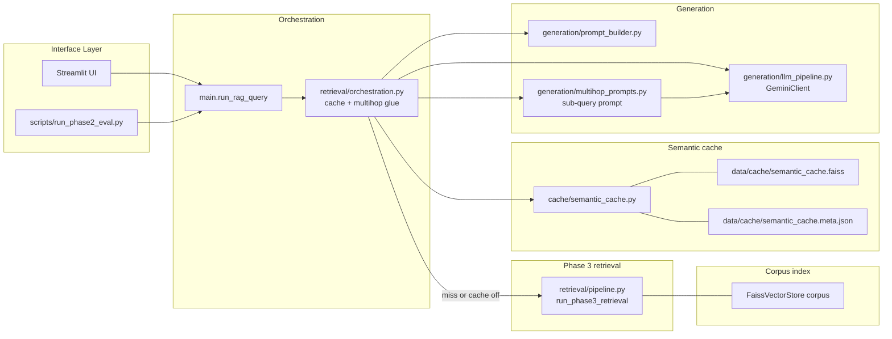
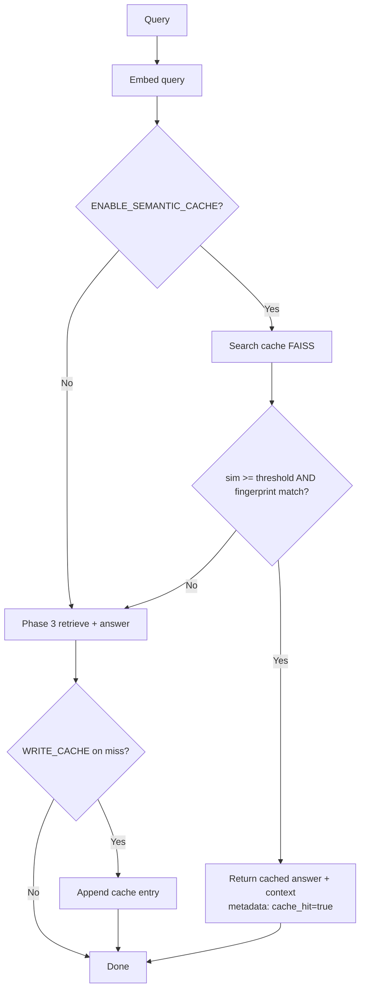
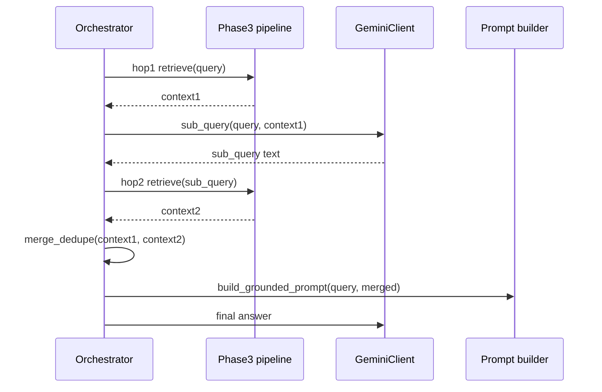

# Phase 4 Semantic Cache + Multi-Hop Retrieval Design

## Goal

Reduce repeated-query cost and latency with a **semantic cache**, and improve **compositional** questions via a **two-hop retrieval** path (initial retrieve → sub-query refinement → supplemental retrieve → merged context → answer).

## Scope

This design covers:

- Semantic similarity cache over **query embeddings**, with **index fingerprinting** so stale answers are not served after re-indexing.
- Configurable cache hit threshold, max entries (eviction policy), and on/off flag.
- **Two-hop** retrieval orchestration using existing **Vertex Gemini** for sub-query generation and existing **Phase 3** pipeline for each hop.
- Merge and **deduplicate** context by `chunk_id` between hops.
- Integration at **`main.run_rag_query`** (and eval script path unchanged: still calls `run_rag_query`).
- Debug/metadata fields for UI/traces: e.g. `cache_hit`, `hop_count`, `sub_query` (when multi-hop).

Out of scope (later phases or follow-ups):

- LangGraph-based graph UI or arbitrary-depth agent loops (see **Roadmap note** below).
- Distributed cache (Redis); multi-user cache invalidation beyond file fingerprint.
- Phase 5 table/image routing.

## What this phase uses

| Category | Items |
|----------|--------|
| **From Phase 3** | **`run_phase3_retrieval`** (`retrieval/pipeline.py`) for every retrieval hop — dense, hybrid BM25, rerank unchanged |
| **From Phase 1** | Same **`Embedder.embed_query`** for query vectors; same corpus FAISS paths via `Settings` |
| **Semantic cache** | **`cache/semantic_cache.py`** — separate FAISS index of past **query** embeddings + JSON metadata; **`cache/index_fingerprint.py`** — `compute_index_fingerprint` ties cache validity to corpus index + sparse path + embedding model (and later: visual index fields when present) |
| **Multi-hop** | **`retrieval/multihop.py`** — `should_multihop`, `generate_sub_query`, `merge_contexts`; **`generation/multihop_prompts.py`** — sub-query prompt text; **`generation/llm_pipeline.GeminiClient`** — JSON sub-query |
| **Orchestration** | **`main.run_rag_query`** — cache branch, multi-hop branch, then `answer_query` |
| **Libraries** | **faiss-cpu**, **numpy** (cache index); **vertex AI** via existing Gemini client |
| **Configuration** | `.env.example` / `Settings`: `ENABLE_SEMANTIC_CACHE`, `SEMANTIC_CACHE_*`, `ENABLE_MULTI_HOP`, `MULTI_HOP_MODE`, `MULTI_HOP_MERGED_TOP_K` |

Optional **pre-retrieval query rewrite + dual merge** is a separate extension; see [`2026-04-17-phase-4-query-refinement-design.md`](./2026-04-17-phase-4-query-refinement-design.md).

## Roadmap alignment

The multimodal roadmap ([`2026-04-16-multimodal-rag-phase1-6-design.md`](./2026-04-16-multimodal-rag-phase1-6-design.md)) names **LangGraph** for multi-hop control. This Phase 4 delivery uses a **small in-repo orchestrator** (plain Python: retrieve → LLM sub-query → retrieve → merge) to avoid a new graph runtime dependency and keep behavior testable. A future **Phase 4.1** may refactor the same steps into LangGraph if branching, human-in-the-loop, or >2 hops become requirements.

## Architecture Overview

1. **Cache lookup** (if enabled): embed query; search a **dedicated FAISS cache index** (same embedding model/dim as corpus); if best similarity ≥ threshold **and** **cache fingerprint** matches current index/corpus, return stored answer + context immediately.
2. **Cache miss**: run existing **Phase 3** retrieval → generation as today; optionally **write** new cache entry (embedding + answer + context + fingerprint).
3. **Multi-hop** (if enabled): run **hop 1** Phase 3 retrieval; call Gemini with a constrained prompt to emit a **follow-up sub-query** (JSON); run **hop 2** Phase 3 retrieval; **merge** contexts (dedupe by `chunk_id`, preserve order: hop 1 first); generate final answer from merged context.

## Architecture Diagrams

### Component and file mapping (target)

### Cache hit / miss flow

### Multi-hop flow (two hops)

## Module boundaries

### 1) Index fingerprint (`cache/index_fingerprint.py` or `retrieval/index_fingerprint.py`)

**Responsibilities**

- Compute a stable string (or hash) from **corpus identity**: e.g. `faiss_index_path` resolved file mtime/size + `sparse_index_path` if hybrid enabled + `embedding_model` name.
- Used by cache **get** and **set** so re-indexing or model change invalidates hits without manual flush.

**Inputs**

- `Settings` (paths, flags, embedding model id).

**Outputs**

- Short fingerprint string (e.g. hex digest).

### 2) Semantic cache (`cache/semantic_cache.py`)

**Responsibilities**

- Maintain **FaissVectorStore** (or `IndexFlatIP` + metadata list) of **past query embeddings** only.
- Persist to `SEMANTIC_CACHE_FAISS_PATH` + sidecar JSON for payloads: answer text, serialized context list, fingerprint, optional raw query string.
- `lookup(query_vector, fingerprint) -> None | CacheHit`
- `store(query_vector, fingerprint, query_text, answer, context_list)` with optional **max_entries** eviction (FIFO or drop lowest similarity stub — document choice: **FIFO by entry id** for simplicity).

**Inputs**

- Query embedding (same dim as embedder), current fingerprint.

**Outputs**

- Hit: answer + context + metadata. Miss: `None`.

### 3) Multi-hop controller (`retrieval/multihop.py`)

**Responsibilities**

- `should_multihop(query: str, settings) -> bool` — modes: `off`, `always`, `heuristic` (e.g. comparative keywords: compare, versus, difference, both, relationship between).
- `generate_sub_query(query, context_chunks, llm) -> str` — structured JSON in prompt; parse failure → **no hop 2** (degrade to single-hop).
- `merge_contexts(a, b) -> list[dict]` — dedupe by `chunk_id`, cap total length to `settings.top_k` or a new `multihop_merged_top_k` (configurable).

**Inputs**

- User query, hop-1 context, `GeminiClient`, settings.

**Outputs**

- Merged context list for final prompt.

### 4) Prompt helpers (`generation/multihop_prompts.py`)

**Responsibilities**

- Single function building the sub-query instruction (no chain-of-thought leakage; require JSON `{"sub_query": "..."}`).

## Data contracts

### Cache entry (persisted metadata)

- `query_text`: str
- `answer`: str
- `context`: list of **FinalContextItem** (same shape as today: `chunk_id`, `text`, `page`, `score`, `score_source`)
- `fingerprint`: str
- `created_at`: ISO timestamp (optional, for debugging)

### Extended response metadata (or return type)

`run_rag_query` may return a third value later; **Phase 4 minimal change**: keep `tuple[str, list[dict]]` but attach optional keys on context items only if needed, or use Langfuse `_trace_event` with `cache_hit`, `hops`, `sub_query`. **Preferred**: extend trace metadata in `_trace_event` and add **Streamlit** optional expander fields via a small **sidecar dict** returned from an internal helper — **implementation plan** will choose the smallest API change (likely trace + optional `st.session_state` debug in UI).

## Configuration surface

| Env / setting | Default | Purpose |
|---------------|---------|---------|
| `ENABLE_SEMANTIC_CACHE` | `false` | Master switch |
| `SEMANTIC_CACHE_THRESHOLD` | `0.92` | Min cosine similarity for hit |
| `SEMANTIC_CACHE_MAX_ENTRIES` | `500` | Eviction cap |
| `SEMANTIC_CACHE_PATH` | `data/cache/semantic_cache` | Base path (`.faiss` + `.meta.json`) |
| `ENABLE_MULTI_HOP` | `false` | Master switch |
| `MULTI_HOP_MODE` | `heuristic` | `off` / `heuristic` / `always` |
| `MULTI_HOP_MERGED_TOP_K` | same as `top_k` | Max chunks after merge |

## Execution flow (combined)

1. Compute **fingerprint** from settings/paths.
2. If cache enabled: **lookup**; on hit return cached result (skip retrieval + LLM for answer — **note**: still skip generation entirely on cache hit).
3. Else if multi-hop enabled and `should_multihop`:
   - Hop 1: `run_phase3_retrieval`
   - Sub-query via Gemini
   - Hop 2: `run_phase3_retrieval(sub_query)`
   - Merge contexts; **one** `answer_query(original_query, merged, settings)`
4. Else: existing single-pass `run_phase3_retrieval` + `answer_query`.

### Extension: LLM query refinement + dual retrieval (2026-04-17)

Optional **pre-retrieval** rewrite: Gemini produces a short search-oriented query; the pipeline embeds **raw + refined**, runs **two** Phase 3 retrievals, and **merges** chunks by `chunk_id` (max score, `retrieval_source` metadata). Final prompt keeps the **original user question** and documents the rewrite used for retrieval.

- **Design:** [`2026-04-17-phase-4-query-refinement-design.md`](./2026-04-17-phase-4-query-refinement-design.md)
- **Implementation / code map:** [`../plans/2026-04-17-phase-4-query-refinement-implementation.md`](../plans/2026-04-17-phase-4-query-refinement-implementation.md)

**Interactions:** Semantic cache is disabled while `ENABLE_QUERY_REFINEMENT` is on. Query-image uploads skip refinement. Multi-hop uses dual-merge for hop 1, then the existing sub-query hop 2.

## Error handling and fallbacks

- Cache file corrupt or dim mismatch: log warning, disable cache for process or delete and recreate empty index.
- Sub-query JSON parse error: use hop-1 context only for final answer.
- Second hop retrieval empty: merge with hop 1 only.
- Any exception in cache path: fall through to normal RAG (same as Phase 3 try/except philosophy).

## Testing strategy

### Unit tests

- Fingerprint changes when faiss path file stats change (mock or temp files).
- Cache store/lookup round-trip; miss on wrong fingerprint; miss below threshold.
- `merge_contexts` dedupes and respects top_k cap.
- `should_multihop` heuristic vs modes.

### Integration tests

- `run_rag_query` with cache enabled: second identical query hits (mock embedder optional — or fixed seed small index).
- Multi-hop: mock `GeminiClient` to return fixed sub-query; assert two retrieval calls and merged context length.

### Regression

- Phase 2 eval with cache **off** and multi-hop **off** matches prior behavior.
- Optional report with cache on measuring latency (manual or script timing).

## Success criteria

- Repeated semantically equivalent queries show **lower latency** and **no second LLM answer call** on cache hit (trace or timing).
- Multi-hop path improves subjective quality on **compositional** eval questions (subset), without breaking single-hop defaults.

## Spec self-review

- **Placeholders**: none; paths and flags named explicitly.
- **Contradictions**: LangGraph deferred to 4.1; orchestrator is plain Python.
- **Ambiguity**: eviction = FIFO by append order unless plan specifies otherwise.
- **Scope**: Phase 4 core avoids Phase 5/6-specific routing; **pre-retrieval dual-query merge** is documented as an extension (linked above), not a change to cache/multi-hop contracts.

---

**Next step:** Implementation plan in [`docs/superpowers/plans/2026-04-17-phase-4-cache-multihop-implementation.md`](../plans/2026-04-17-phase-4-cache-multihop-implementation.md). Please review this spec before coding. Extension: [`2026-04-17-phase-4-query-refinement-implementation.md`](../plans/2026-04-17-phase-4-query-refinement-implementation.md).
