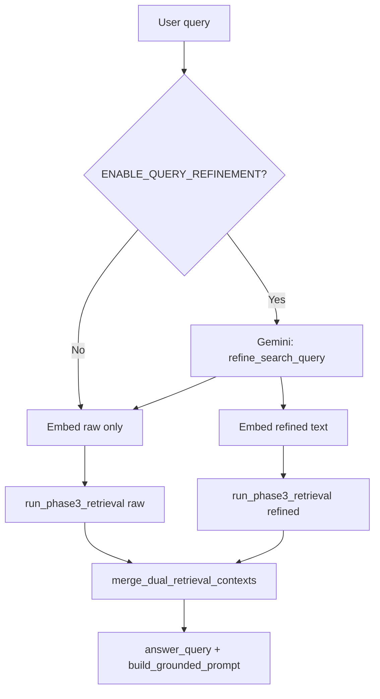

# Phase 4 extension — LLM query refinement + dual retrieval

## Goal

Optionally improve recall and query–index alignment by:

1. Sending the **user’s raw text** to Gemini for a **single** short rewrite aimed at **search** (keywords and entities preserved; no answer).
2. **Embedding both** the raw question and the rewrite.
3. Running the **existing Phase 3 path** twice: dense (+ hybrid BM25 on the respective query string) + rerank + Phase 6 visual fusion when applicable.
4. **Merging** the two ranked chunk lists into one context for generation, without dropping unique hits from either pass.

This is **orthogonal** to multi-hop: multi-hop adds a **second hop** driven by a **sub-query** derived from hop-1 context; query refinement adds a **parallel first pass** over two query formulations.

## What this phase uses

| Category | Items |
|----------|--------|
| **From Phase 3** | Two calls to **`run_phase3_retrieval`** with different `(query_string, query_vector)` pairs — same hybrid + rerank + (Phase 6) visual fusion rules per call |
| **From Phase 4 core** | **`main.run_rag_query`** orchestration; multi-hop still uses dual-merge for **hop 1** when both flags are on |
| **LLM** | **`generation/query_refinement.py`** → **`GeminiClient`** (`generation/llm_pipeline.py`) — one short text rewrite |
| **Merge** | **`retrieval/dual_query_merge.merge_dual_retrieval_contexts`** — union by `chunk_id`, max score, `retrieval_source` |
| **Prompt** | **`generation/prompt_builder.build_grounded_prompt`** — optional `refined_query` line; **`main.answer_query`** passes `refined_query_text` |
| **Embeddings** | **`Embedder.embed_query`** twice (raw + refined) when refinement succeeds |
| **Config** | `Settings.enable_query_refinement` / `ENABLE_QUERY_REFINEMENT`; semantic cache **disabled** while refinement is enabled |

## Scope

**In scope**

- Feature flag `ENABLE_QUERY_REFINEMENT` (default off).
- Orchestration in `main.run_rag_query` after modality routing, before / alongside embedding.
- Merge policy: union by `chunk_id`, score = `max(score_raw, score_refined)`, row from the pass with the higher score; metadata `retrieval_source`: `raw` | `refined` | `both`.
- Final prompt includes the **original user question** plus a line documenting the **rewrite used for retrieval** (so the model answers the user, not the rewrite).
- Trace metadata: `refined_query` when dual retrieval runs.

**Out of scope**

- Multiple rewrite variants (A/B ensembles).
- Learned fusion weights per field (beyond max-score row pick).
- Caching dual-query fingerprints in the semantic cache (cache is explicitly disabled when refinement is on).

## Architecture

**With multi-hop:** hop 1 uses merged dual context (cap `dual_cap`); `generate_sub_query` sees the top `TOP_K` rows of that merge; hop 2 unchanged (single query vector from sub-query).

**With query image:** refinement is **skipped** (vision path unchanged).

## Configuration

| Env / `Settings` field | Default | Purpose |
|------------------------|---------|---------|
| `ENABLE_QUERY_REFINEMENT` / `enable_query_refinement` | `false` | Master switch |

Other retrieval limits (`TOP_K`, `HYBRID_TOP_N`, `MULTI_HOP_MERGED_TOP_K`, etc.) behave as today; dual-merge for multi-hop hop 1 uses `dual_cap = min(HYBRID_TOP_N, max(TOP_K * 2, MULTI_HOP_MERGED_TOP_K))` (see `main.run_rag_query`).

## Semantic cache

When `enable_query_refinement` is true, **semantic cache lookup and store are skipped** (same class of reasons as query-image and ColPali retrieval: the cache key is a single query vector and does not represent dual retrieval).

## Data contract (context chunks)

Each merged chunk may include:

- Existing keys: `chunk_id`, `text`, `page`, `score`, `score_source`, `modality`, …
- **`retrieval_source`**: `raw` if only the raw pass contributed that id; `refined` if only the refined pass; `both` if both passes returned the same `chunk_id` (score is still the max of the two).

## Error handling

- Refinement LLM failure or empty/duplicate rewrite → fall back to **raw-only** retrieval (no second pass).
- Refined-query embedding failure → clear refined string and raw-only path.

## Success criteria

- With flag off, behavior matches pre-feature Phase 3/4/5/6 orchestration.
- With flag on, traces show `refined_query` when a distinct rewrite was used; merged context includes chunks tagged `both` when appropriate.
- Final answers remain grounded on merged context; prompt states original question explicitly.

## Related documents

- Base Phase 4: [`2026-04-17-phase-4-cache-multihop-design.md`](./2026-04-17-phase-4-cache-multihop-design.md)
- Implementation / file map: [`../plans/2026-04-17-phase-4-query-refinement-implementation.md`](../plans/2026-04-17-phase-4-query-refinement-implementation.md)
