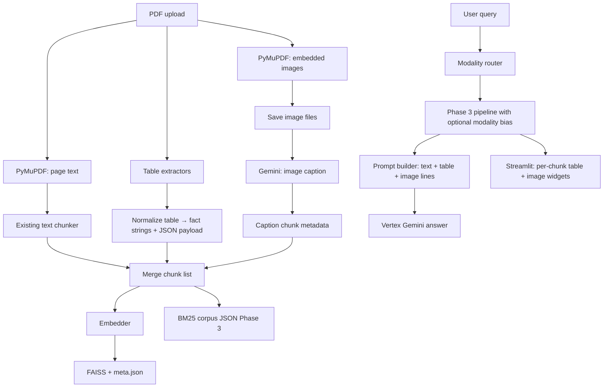

# Phase 5 Practical Multimodal (Tables + Images) Design

## Goal

Extend the text RAG stack so **tables** and **document images** become first-class evidence: extract structured table facts and image captions, **embed them in the same dense + sparse index** as body text (caption/table-as-text), and optionally **route** queries toward table- or image-heavy retrieval. This phase **does not** implement true visual embedding retrieval (that is Phase 6).

## Scope

In scope:

- **Table extraction** from PDFs (lattice/stream where available), normalization to row/column text and compact JSON-friendly facts, and **indexing** as dedicated chunks with rich metadata (`modality=table`, `table_id`, headers).
- **Image extraction** via PyMuPDF (already a dependency), on-disk assets under a per-document directory, **Gemini multimodal captioning** (Vertex), and **indexing** caption text as chunks (`modality=image`, `image_id`, `asset_path`).
- **Unified index**: one FAISS store + one BM25 corpus (Phase 3) for text, table, and image-caption chunks; shared `chunk_id` / `doc_id` / `page` conventions.
- **Query router** (configurable): heuristic keywords and/or a small LLM JSON classifier to bias retrieval (`text` | `table` | `image` | `mixed`) — implemented as **metadata filter or score boost**, not a separate vector DB.
- **Prompt / context** formatting so the generator sees table facts and image captions clearly (with page and asset references).
- **Streamlit UI:** for each retrieved context row, **render evidence visually** when metadata allows: **tables** via `st.dataframe` / `st.table` from `table_json`, **figures** via `st.image` from `asset_path`, with text/caption fallback and debug JSON optional.

Out of scope (Phase 6+):

- CLIP / ColPali visual embeddings, patch-level late interaction, multimodal-only answer models.
- OCR of scanned pages as a full replacement for digital text (optional future note only).

## What this phase uses

| Category | Items |
|----------|--------|
| **From Phase 3** | Same **FAISS + BM25** index for all chunk types; **`run_phase3_retrieval`** with optional modality bias |
| **From Phase 1** | **`Embedder`**, chunk → vector → FAISS add; **`GeminiClient`** for answers and optional router |
| **PDF / layout** | **PyMuPDF** — text pages, embedded images (`ingestion/images_extract.py`); **pdfplumber** (default) / optional **Camelot** — tables (`ingestion/tables_extract.py`) |
| **Table pipeline** | **`ingestion/tables_normalize.py`** — table rows → text + `table_json` metadata |
| **Images** | On-disk assets under **`ASSETS_DIR`** / `doc_id`; **`generation/image_caption.py`** — Vertex **multimodal** caption → caption chunks |
| **Routing** | **`retrieval/modality_router.py`** (heuristic + optional `ROUTER_USE_LLM`); **`retrieval/modality_rank.py`** — score bias in `retrieval/pipeline.py` |
| **Prompt / UI** | **`generation/prompt_builder.py`** — `[table pN]` / `[figure pN]` lines; **`ui/context_evidence.py`** + **`ui/app.py`** — dataframe / image widgets |
| **Optional rendering** | **`ingestion/page_render_extract.py`** — page pixmaps when `ENABLE_IMAGE_PAGE_RENDERS` |
| **Libraries** | **Pillow**, **pandas** (tables/eval); optional **camelot-py** — see `requirements.txt` / README |
| **Configuration** | `.env.example` — `ENABLE_TABLE_EXTRACTION`, `ENABLE_IMAGE_CAPTIONS`, `ENABLE_MODALITY_ROUTER`, `ROUTER_USE_LLM`, `ASSETS_DIR`, `TABLE_EXTRACTOR`, `IMAGE_*`, etc. |

## Architecture overview

## Streamlit UI: retrieved evidence rendering

Phase 5 is not complete until the chat **“Retrieved context”** (or a sibling expander) shows **what** was retrieved, not only JSON:

1. **Per chunk** (in retrieval order): show `chunk_id`, `page`, `score` / `score_source`, then a **rendered** block:
   - **`modality == "image"`** (or presence of `asset_path`): if the file exists relative to repo root (or a configurable `ASSETS_DIR` / `Path.cwd()`), call **`st.image`** with a short caption (caption text + page). If the file is missing, show caption text + warning.
   - **`modality == "table"`** and **`table_json`** present (headers + rows): **`st.dataframe`** (preferred) or **`st.table`**. If only `text` is present, show **`st.markdown`** in a scrollable container or monospace block.
   - **`modality == "text"`** or default: keep concise text preview (existing behavior).

2. **Debug:** optional nested **`st.json(chunk)`** collapsed under “Raw metadata” so power users still see full payloads.

3. **Contract:** **`build_final_context`** (and dense fallback **`retrieve_context`**) must **pass through** optional keys needed for UI: at minimum `modality`, `asset_path`, `table_json`, `table_id`, `image_id` when present on the candidate metadata. Without this, the UI cannot render tables/images after retrieval.

## Data contracts

### Chunk metadata (FAISS / BM25 / context)

All chunks remain compatible with **`build_final_context`** and **`build_grounded_prompt`**, with **optional** extra keys (ignored by simple prompts if stripped):

| Field | Required | Description |
|--------|----------|-------------|
| `chunk_id` | yes | Stable id, e.g. `{doc_id}_p{page}_table{t}_r{r}` or `..._img{i}` |
| `doc_id` | yes | PDF stem |
| `page` | yes | 1-based page |
| `text` | yes | Embedding text: body slice, **serialized table fact**, or **image caption** |
| `modality` | yes for new types | `text` (default), `table`, `image` |
| `table_id` | optional | Per-page table ordinal |
| `image_id` | optional | Per-doc image ordinal |
| `asset_path` | optional | Relative path to image file on disk (for UI / future vision) |
| `table_json` | optional | Small structured snapshot (headers + row list) for prompt formatting |

**Default:** existing chunks omit `modality`; ingestion sets `modality="text"` explicitly for clarity in Phase 5 code paths.

### Table normalization

- Output **one or more strings per table** (e.g. “Column A: X; Column B: Y” per row, or capped markdown table snippet) suitable for embedding.
- Cap row/cell count per chunk to avoid huge texts (configurable `TABLE_MAX_ROWS_PER_CHUNK`).

### Image assets

- Path pattern: `data/parsed/assets/{doc_id}/page_{p}_img_{i}.{ext}`
- Captions stored in chunk `text`; **`asset_path`** for Streamlit `st.image` optional display.

## Module boundaries (target layout)

| Module | Responsibility |
|--------|------------------|
| `ingestion/tables_extract.py` | Try Camelot (lattice/stream); optional fallback (e.g. pdfplumber) if Camelot unavailable; return list of table dicts per page |
| `ingestion/tables_normalize.py` | Table → list of chunk dicts with `text` + `table_json` |
| `ingestion/images_extract.py` | PyMuPDF enumerate images, write bytes to disk, return metadata |
| `generation/image_caption.py` | Gemini multimodal: image bytes → short caption (and optional “chart vs photo” hint) |
| `retrieval/modality_router.py` | `route_query(query, settings) -> ModalityIntent` |
| `retrieval/pipeline.py` (extend) | Optional **boost or filter** by `modality` in candidate list post-fusion (simple: rerank filter, or score boost before final top_k) |
| `generation/prompt_builder.py` (extend) | Format context lines by modality (e.g. `[table p3]`, `[image p5: path]`) |
| `ui/context_evidence.py` (optional) | `render_context_chunk(chunk: dict)` — image / table / text branches for Streamlit |
| `retrieval/pipeline.py` **`build_final_context`** (extend) | Copy `modality`, `asset_path`, `table_json`, etc. from candidates into each context item |

**Orchestration:** `main.index_pdf` (or a dedicated `ingestion/multimodal_index.py` called from `index_pdf`) runs text path, then conditional table/image paths, merges chunk lists, then single `embed_texts` + `store.add` + save.

## Router behavior

- **Heuristic:** keywords (`table`, `chart`, `figure`, `image`, `row`, `column`, `%`, `million`, etc.) map to `table` / `image` / `mixed`.
- **Optional LLM:** single JSON `{"intent":"text|table|image|mixed"}` via Gemini when `ROUTER_USE_LLM=true`.
- **Retrieval effect:** e.g. prefer chunks where `modality` matches intent when building final top_k (still allow mixed); if no table/image chunks in index, behavior equals Phase 4.

## Configuration surface (env)

| Variable | Default | Purpose |
|----------|---------|---------|
| `ENABLE_TABLE_EXTRACTION` | `false` | Master switch |
| `ENABLE_IMAGE_CAPTIONS` | `false` | Master switch |
| `ENABLE_MODALITY_ROUTER` | `false` | Router on |
| `ROUTER_USE_LLM` | `false` | LLM vs heuristic only |
| `TABLE_MAX_ROWS_PER_CHUNK` | `20` | Chunking cap |
| `IMAGE_CAPTION_MAX_SIDE` | `1024` | Resize before caption (save API payload) |
| `ASSETS_DIR` | `data/parsed/assets` | Image root |

**Dependencies:** add optional `camelot-py[cv]` (or document system deps); consider `pdfplumber` as fallback in plan. Ghostscript/Java constraints documented in README.

## Error handling

- Table lib import failure → log warning, skip tables, text index still succeeds.
- Image caption API failure → skip image chunk or use placeholder “[image on page N]” (plan chooses minimal: skip chunk).
- Router failure → default `text`.

## Testing strategy

- Unit: normalize synthetic table dict → expected chunk strings; router keyword cases; prompt builder includes modality tags.
- Unit: **`build_final_context`** (or equivalent) preserves `table_json` / `asset_path` / `modality` on output dicts.
- Unit: **`render_context_chunk`** (if extracted) does not crash on text-only, table_json-only, and missing file paths (mock Streamlit if needed).
- Integration: small fixture PDF or mocked extractors → merged chunk list length and metadata; FAISS dim unchanged.
- No requirement for network in default CI (mock Gemini caption).

## Success criteria

- Indexing produces table and/or image-caption chunks when enabled and libraries available.
- Queries about numeric/tabular content retrieve `modality=table` chunks when present.
- Image-related queries retrieve caption chunks; **the Streamlit context panel shows thumbnails** for image chunks when `asset_path` resolves.
- **Table chunks with `table_json` render as a grid** in the Streamlit context panel; text-only table chunks still show a readable fallback.
- With Phase 5 flags off, behavior matches Phase 4 and the UI shows text context only (no errors).

## Spec self-review

- Single unified index avoids dual-query complexity for Phase 5.
- Phase 6 adds CLIP-class retrieval (see [Phase 6 spec](2026-04-17-phase-6-visual-retrieval-design.md)); this spec defers that work.
- Camelot/Tabula per roadmap; implementation plan may add pdfplumber fallback for developer ergonomics.
- **UI rendering** is a Phase 5 deliverable, not optional: requires **`build_final_context` (and fallbacks) to preserve** `modality` / `asset_path` / `table_json` end-to-end.

---

**Next:** [Phase 5 implementation plan](../plans/2026-04-17-phase-5-tables-images-implementation.md) · [Phase 6 visual retrieval design](2026-04-17-phase-6-visual-retrieval-design.md)
