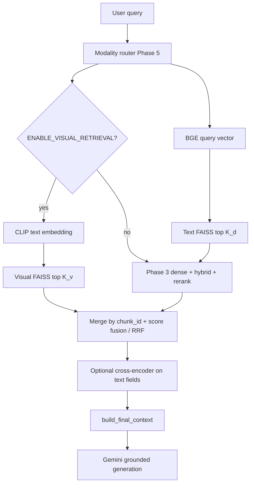

# Phase 6 Visual Retrieval (Beyond Caption Dense Search)

## Goal

Add **true multimodal retrieval** for document visuals: query and image regions are represented in a **shared visual–language embedding space**, so retrieval is not limited to **paraphrase match** between the user’s words and Gemini captions (Phase 5). Phase 6 **layers** on the existing stack (FAISS text index, hybrid BM25, cross-encoder rerank, modality router) with an **optional visual index** and **score fusion**, preserving a **safe fallback** to Phase 5 caption retrieval when the visual path is off, empty, or errors.

This spec is scoped to what this repository can adopt incrementally; **ColPali-style late interaction** and **third-party VLMs** are specified as **extensions** (6.1+) rather than mandatory day-one deliverables.

## Relationship to Phase 5

| Capability | Phase 5 | Phase 6 |
|------------|---------|---------|
| Image evidence | Raster xref + page/figure **pixmaps**; **caption text** embedded with BGE | Same assets; **additional** vectors from a **vision–language encoder** (e.g. CLIP) on **image pixels** |
| Query | Single **text** embedding (BGE) for all chunks | **Text branch** unchanged; **visual branch** uses **text tower** (or aligned query encoder) for image-style queries |
| Tables | Structured text + `table_json` | Unchanged for 6.0 (remain **text-first**); optional later: render table crop as image for CLIP (out of scope for initial PR) |
| Index | One `FaissVectorStore` / one metadata list | **Second** FAISS index (or second flat index file) keyed to **`chunk_id`** for rows where `modality == "image"` and `asset_path` resolves |
| Failure | N/A | **Degrade** to Phase 5 dense+hybrid only; log `visual_retrieval_skipped` |

## Scope

### In scope (Phase 6.0 — recommended first ship)

- **Dual-index contract**: keep **existing** text embedding index; add **`VISUAL_FAISS_INDEX_PATH`** (or `*.visual.faiss` sibling) whose metadata rows **reference the same `chunk_id` / `doc_id` / `page` / `asset_path`** as Phase 5 image chunks where possible.
- **Image-side encoding**: run a **CLIP-class** model (image tower) over files under `ASSETS_DIR` that correspond to indexed image chunks (embedded + page render).
- **Query-side encoding**: CLIP **text tower** for the raw user query when visual retrieval is enabled and intent is `image` or `mixed` (or global toggle for A/B tests).
- **Candidate pool**: visual search returns top-`K_v` by cosine/IP; **merge** with Phase 3 dense/hybrid top-`K_d` on **`chunk_id`**; **fuse** scores (weighted sum or RRF); then optionally **rerank** fused list with existing cross-encoder using **caption/text** fields (unchanged) or skip rerank for pure-visual hits (configurable).
- **Configuration**: env flags for enable/disable, model id, visual top-k, fusion weights, GPU/CPU device.
- **Observability**: trace fields `visual_topk`, `fusion_alpha`, `visual_index_ntotal`.
- **Documentation + implementation plan**: this spec + sibling plan with checkbox tasks.

### In scope later (Phase 6.1+ — document, implement when resourcing allows)

- **Late interaction** (ColPali / MaxSim-style multi-vector per page or per patch grid): higher GPU memory and dependency surface; not required to close 6.0.
- **Multimodal answer model** (e.g. pass retrieved image bytes into Vertex multimodal chat for final answer): optional **parallel** to current text-only `build_grounded_prompt` + Gemini text; gated by env.
- **Table-as-image** CLIP encoding of rendered table crops.
- **ViDoRe-style** benchmarks wired into Phase 2 eval harness.

### Out of scope

- Replacing Phase 5 ingestion (pixmaps, captions, `pdf_caption`) — Phase 6 **consumes** those artifacts.
- OCR as full-document replacement (same as Phase 5 parent doc).
- Multi-tenant auth, product billing.

## What this phase uses

### Shared dependencies (6.0 and ColPali)

| Category | Items |
|----------|--------|
| **Prior phases** | Phase **5** image assets + captions + `chunk_id`; Phase **3** dense + BM25 + rerank pipeline; Phase **4** fingerprint may include visual / ColPali paths |
| **Core libraries** | **Python**, **numpy**, **faiss-cpu**, **torch** (CLIP and ColPali both); **google-cloud-aiplatform** for Gemini answers |
| **Orchestration** | **`main.index_pdf`**, **`main.run_rag_query`**, **`main.answer_query`** |

### Phase 6.0 — CLIP-class visual index + fusion

| Category | Items |
|----------|--------|
| **Modules** | `retrieval/visual_embedder.py` (CLIP / OpenCLIP-style lazy load), `retrieval/visual_fusion.py`, `retrieval/visual_index.py` (load/build helpers), `retrieval/pipeline.py` (fusion inside `run_phase3_retrieval`) |
| **Artifacts** | Second FAISS file at `VISUAL_FAISS_INDEX_PATH`; metadata aligned to Phase 5 `chunk_id` / `asset_path` |
| **Scripts** | `scripts/rebuild_visual_faiss.py` (rebuild visual index from existing metadata + assets) |
| **Configuration** | `ENABLE_VISUAL_RETRIEVAL`, `VISUAL_EMBEDDING_MODEL`, `VISUAL_TOP_K`, `VISUAL_FUSION_LAMBDA`, `VISUAL_DEVICE`, `VISUAL_BATCH_SIZE`, `VISUAL_FOR_IMAGE_INTENT_ONLY`, … — see `.env.example` |

### Phase 6.1+ — ColPali full-page late interaction (in-repo)

| Category | Items |
|----------|--------|
| **Modules** | `ingestion/colpali_raster.py` (page PNGs), `retrieval/colpali_retrieval.py` (index build + MaxSim search), `retrieval/torch_device.py` (device selection) |
| **Generation** | `generation/prompt_builder.py` (ColPali hint), `generation/llm_pipeline.py` — `answer_with_images` for page PNG evidence |
| **UI** | `ui/context_evidence.py` — `colpali_page` rows |
| **Scripts** | `scripts/rebuild_colpali.py` |
| **Configuration** | `ENABLE_COLPALI_INDEX`, `ENABLE_COLPALI_RETRIEVAL`, `COLPALI_MODEL_ID`, `COLPALI_INDEX_DIR`, `COLPALI_TOP_K`, `COLPALI_DEVICE`, … — see `.env.example`; `ensure_colpali_fields` in `configs/settings.py` |

## Architecture overview

## Data contracts

### Visual index metadata (minimum)

Each visual-index row must join back to evidence the UI already understands:

| Field | Required | Description |
|--------|----------|-------------|
| `chunk_id` | yes | Same id as Phase 5 image chunk (e.g. `*_p10_render3` or `*_p2_img0`) |
| `doc_id` | yes | PDF stem |
| `page` | yes | 1-based page |
| `asset_path` | yes | Same relative path as text index metadata (for `st.image`) |
| `modality` | yes | Always `image` for 6.0 rows |
| `text` | yes | Copy caption / `pdf_caption` + caption for reranker and generator (denormalized OK) |

**Dimension**: visual vectors live in **CLIP `embedding_dim`** (e.g. 512 or 768), **different** from BGE `text_dim`. Therefore **separate** `faiss.IndexFlatIP` instance; do not mix vectors in the existing text index.

### Fusion (normative recommendation)

Let `s_d` = dense hybrid score (post-fusion Phase 3) and `s_v` = visual cosine score. For candidates present in both lists, use:

\[
s = \lambda \, \hat{s}_d + (1 - \lambda) \, \hat{s}_v
\]

where \(\hat{s}_*\) are min–max normalized per query over the candidate union, and \(\lambda\) defaults to `0.65` (favor text stability). **Reciprocal rank fusion (RRF)** is an acceptable alternative when score scales are incompatible.

### Fallback order

1. If visual index missing or `ntotal == 0` → Phase 3 only.  
2. If CLIP model load fails → Phase 3 only + warning log.  
3. If query intent is `text` and `VISUAL_ONLY_FOR_IMAGE_INTENT=true` (default) → skip visual encoder for latency.  
4. On any uncaught exception in visual path → Phase 3 only.

## Configuration surface (env) — proposed

| Variable | Default | Purpose |
|----------|---------|---------|
| `ENABLE_VISUAL_RETRIEVAL` | `false` | Master switch |
| `VISUAL_EMBEDDING_MODEL` | e.g. `ViT-B-32` / HF id | CLIP-class checkpoint |
| `VISUAL_FAISS_INDEX_PATH` | `data/parsed/faiss.index.visual` | Sibling to text index |
| `VISUAL_TOP_K` | `20` | Depth of visual search before merge |
| `VISUAL_FUSION_LAMBDA` | `0.65` | Weight for text dense vs visual (if using linear fusion) |
| `VISUAL_DEVICE` | `cpu` | `cpu` or `cuda` for image encoder |
| `VISUAL_BATCH_SIZE` | `8` | Inference batch during indexing |

Exact names may be adjusted during implementation; **`ensure_phase6_fields`** should mirror Phase 4/5 hot-reload backfill pattern.

## Dependencies and ops notes

- **CLIP / OpenCLIP**: adds `torch` + vision stack; large wheels; prefer **optional** `requirements-phase6.txt` or extras `[visual]` documented in README.
- **GPU**: optional; CPU indexing is slower but acceptable for small corpora.
- **Index versioning**: bump or embed `embedding_model` + `visual_model` in fingerprint (`compute_index_fingerprint`) so semantic cache does not cross-contaminate.

## Testing strategy

- **Unit**: fusion logic with synthetic scores; normalization; chunk_id merge with duplicates.
- **Unit**: skip visual path when flag off (no torch import if lazy-loaded).
- **Integration** (optional CI): mock CLIP forward → fixed vectors → small FAISS round-trip.
- **Regression**: Phase 5-only mode (visual flag off) identical metrics to pre-6 within noise.

## Success criteria

- With `ENABLE_VISUAL_RETRIEVAL=true` and a built visual index, **image-heavy queries** show **higher recall@k** for the correct `asset_path` than caption-only on a small held-out visual QA set (manual or ViDoRe subset).
- With flag `false`, **no** new imports on hot path; **no** behavior change vs Phase 5.
- Streamlit evidence still renders from **`asset_path`**; visual retrieval only changes **which** image chunks surface first.

## Spec self-review

- **Dual index** avoids breaking the existing `Embedder` + `FaissVectorStore(dim)` contract.
- **Fusion** avoids discarding strong text hits while still injecting visually relevant figures.
- **Late interaction (ColPali)** — **implemented in-repo** after 6.0: full-page rasters (`ingestion/colpali_raster.py`), page embedding index + MaxSim search (`retrieval/colpali_retrieval.py`), merge into context in `main.run_rag_query`, multimodal answer via `generation/llm_pipeline.py` + `main.answer_query`, flags `ENABLE_COLPALI_INDEX` / `ENABLE_COLPALI_RETRIEVAL`, rebuild script `scripts/rebuild_colpali.py`. See implementation plan for file-level notes.

---

**Next:** [`docs/superpowers/plans/2026-04-17-phase-6-visual-retrieval-implementation.md`](../plans/2026-04-17-phase-6-visual-retrieval-implementation.md)
